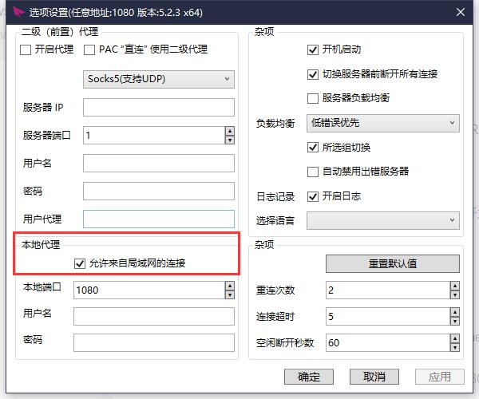
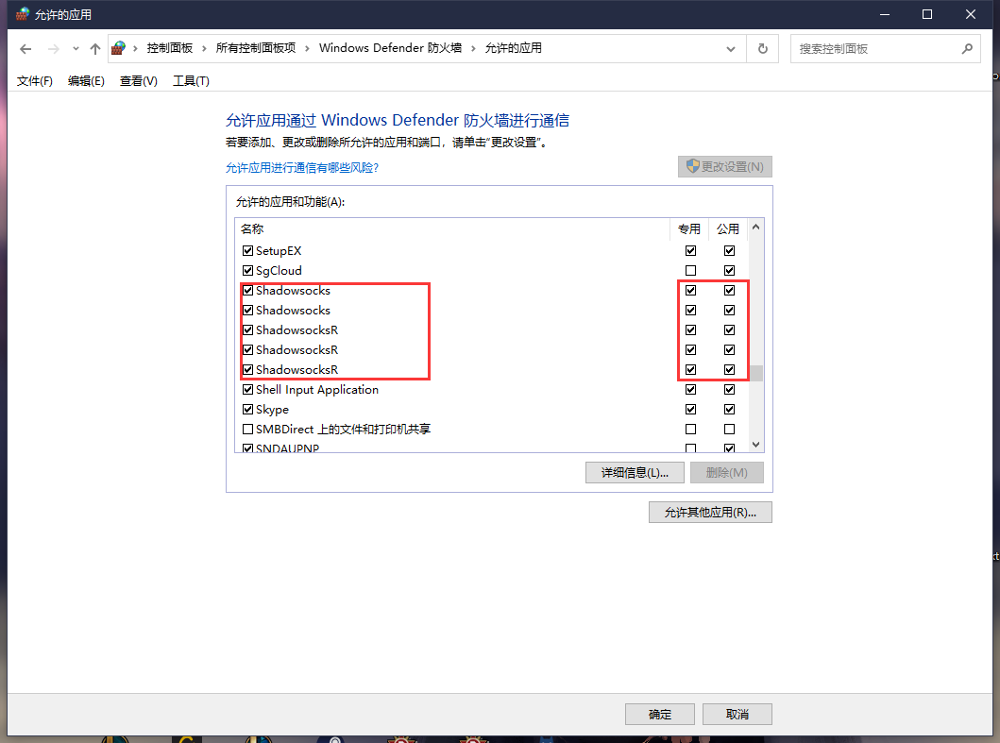

# 一、安装WSL2

参照 https://docs.microsoft.com/en-us/windows/wsl/install-win10


# 二、安装docker desktop windows

参照 https://docs.docker.com/docker-for-windows/install/


# 三、docker在wsl2下的设置

参照 https://docs.docker.com/docker-for-windows/wsl/


# 四、WSL2科学上网

>  对应的软件设置为允许局域网连接（我使用的是SSR）  
 


>  防火墙设置放行




>  在wsl2 terminal中打开```vim ~/.bashrc```（vscode中打开为 ```code ~/.bashrc```），在最下边添加如下代码

```bash
# set http proxy
WSL_MASTER_HOST_IP=`cat /etc/resolv.conf | grep nameserver | awk '{print $2}'`

export http_proxy="http://${WSL_MASTER_HOST_IP}:1080"  # 此处端口对应SSR的本地端口1080

export https_proxy=$http_proxy

export all_proxy=$http_proxy

# set git config http proxy

if [ "`git config --global --get http.proxy`" != "http://$WSL_MASTER_HOST_IP:1080" ]; then

  git config --global http.proxy http://$WSL_MASTER_HOST_IP:1080

fi
```

如果是使用zsh则是打开 ```vim ~/.zshrc```（或者```code ~/.zshrc```），添加上边的代码到末尾

# 五 Git相关设置
> 设置wsl ssh共享请参考https://devblogs.microsoft.com/commandline/sharing-ssh-keys-between-windows-and-wsl-2/

> 设置github代理，使用http:// 协议代替 git://   
> 打开 vim ~/.gitconfig，将下边代码添加至末尾  
``` bash
[url "https://github.com/"]
        insteadOf = git://github.com/
```

> 设置多个ssh连接参照 https://linuxize.com/post/using-the-ssh-config-file/  
> 例如本地配置github、gitee的ssh ```~/.ssh/config```  
```bash
Host github.com
  User git
  Port 22
  Hostname github.com
  # 注意修改路径为你的路径
  IdentityFile "~/.ssh/id_rsa"
  TCPKeepAlive yes

Host ssh.github.com
  User git
  Port 443
  Hostname ssh.github.com
  # 注意修改路径为你的路径
  IdentityFile "~/.ssh/id_rsa"
  TCPKeepAlive yes

Host gitee.com
  User git
  Port 22
  Hostname gitee.com
  # 注意修改路径为你的路径
  IdentityFile "~/.ssh/id_rsa"
  TCPKeepAlive yes

Host ssh.gitee.com
  User git
  Port 443
  Hostname ssh.gitee.com
  # 注意修改路径为你的路径
  IdentityFile "~/.ssh/id_rsa"
  TCPKeepAlive yes

```

# 六、docker项目中文件权限
> 运行docker ps(或相关docker指令)有权限问题时需要修复docker权限
```bash
sudo addgroup --system docker
sudo adduser $USER docker
newgrp docker
```

>  项目文件权限问题，在wsl2下设置文件夹权限为777即可
```bash
# 例如我的工作目录为 ~/workspace
cd ~/
sudo chmod -R 666 workspace/
```

# 注意事项
> 测试链接时请关闭windows下其他代理，防止冲突

